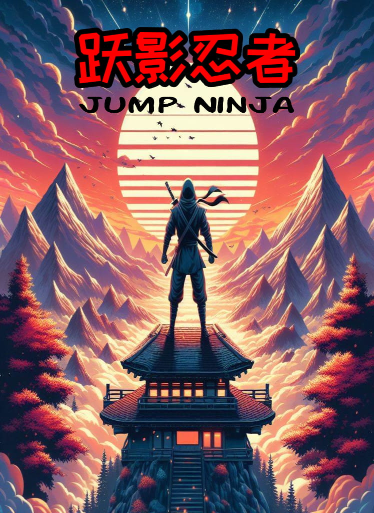

# 跃影忍者
一款有趣的微信小游戏，灵感来源于一款知名游戏——Doodle Jump，使用微信小游戏开发工具开发。

### 游戏封面截图

### 游戏玩法

1. 点击屏幕开始游戏，你需要控制它，按住屏幕，松开，就可以左右横跳，直到到达终点。
2. 该游戏也设置了排行榜，越短时间到达终点，排行越高。
3. 掉下去，则会游戏失败。

### 制作过程

1. 使用微信小游戏开发工具创建项目。
2. 设计游戏界面，包括背景、角色、障碍物等。
3. 编写游戏逻辑，包括角色跳跃、障碍物生成、碰撞检测等。
4. 测试游戏，修复bug，优化游戏体验。
5. 上传游戏到微信小游戏平台，发布游戏。

### 经验分享

- 角色、封面和场景，使用 AI 生成图片，提高了工作效率
- 音乐可以用 Suno 等 AI 生成，几乎完成了之前无法完成的工作

### 游戏内容截图

### 微信扫一扫试玩
